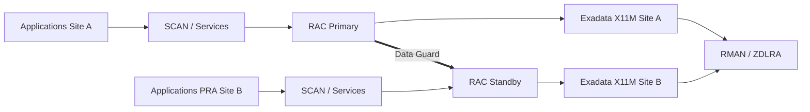

# RA-01 — Dual Exadata X11M On-Premises

## Contexte cible
Plateforme de paiements critique, deux datacenters, forte exigence de contrôle infrastructure et faible tolérance à l’indisponibilité.

## Architecture logique

## Principes
- RAC pour HA locale ;
- Data Guard pour perte de site ;
- RMAN/ZDLRA pour restauration et protection indépendante de la réplication ;
- TDE et gestion de clés disponible sur les deux sites ;
- réseaux séparés client, RDMA/RoCE, management, backup et Data Guard ;
- supervision et tests PRA réguliers.

## Décisions restant à valider
- bare metal ou KVM ;
- ASM ou Exascale ;
- HC/EF/XT ;
- dimensionnement exact ;
- Data Guard SYNC/ASYNC ;
- redondance stockage ;
- topologie ZDLRA ;
- licences.

## Critère de qualité
Cette RA est un point de départ. Une cible réelle n’est approuvable qu’après workload assessment, sizing, mesures réseau et validation RPO/RTO.
