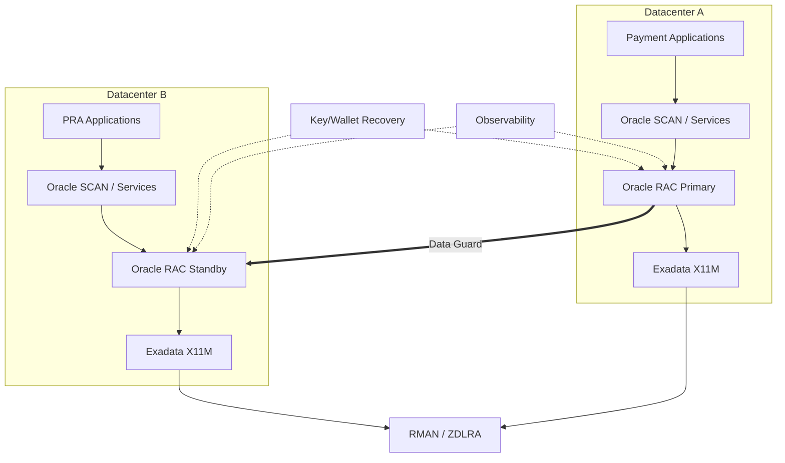

# Diagramme — MayaBank HA/DR

## À vérifier
- mode Data Guard ;
- latence et bande passante ;
- localisation ZDLRA ;
- architecture des clés ;
- capacité N-1 ;
- orchestration applicative de la bascule.
