# Diagramme — Exadata X11M logique

```mermaid
flowchart TB
  A[Applications] --> S[SCAN / Database Services]
  S --> DB[Oracle Database / RAC]
  DB --> GI[Grid Infrastructure]
  GI --> F[RDMA Network Fabric / RoCE]
  F --> C1[Storage Server]
  F --> C2[Storage Server]
  F --> C3[Storage Server]
  C1 --> X1[XRMEM / Flash / Persistent Storage]
  C2 --> X2[XRMEM / Flash / Persistent Storage]
  C3 --> X3[XRMEM / Flash / Persistent Storage]
```

## Lecture architecte
Le schéma ne suffit pas à dimensionner. Il faut relier compute, mémoire, I/O, capacité, réseau, redondance et profils de charge à des mesures réelles.
